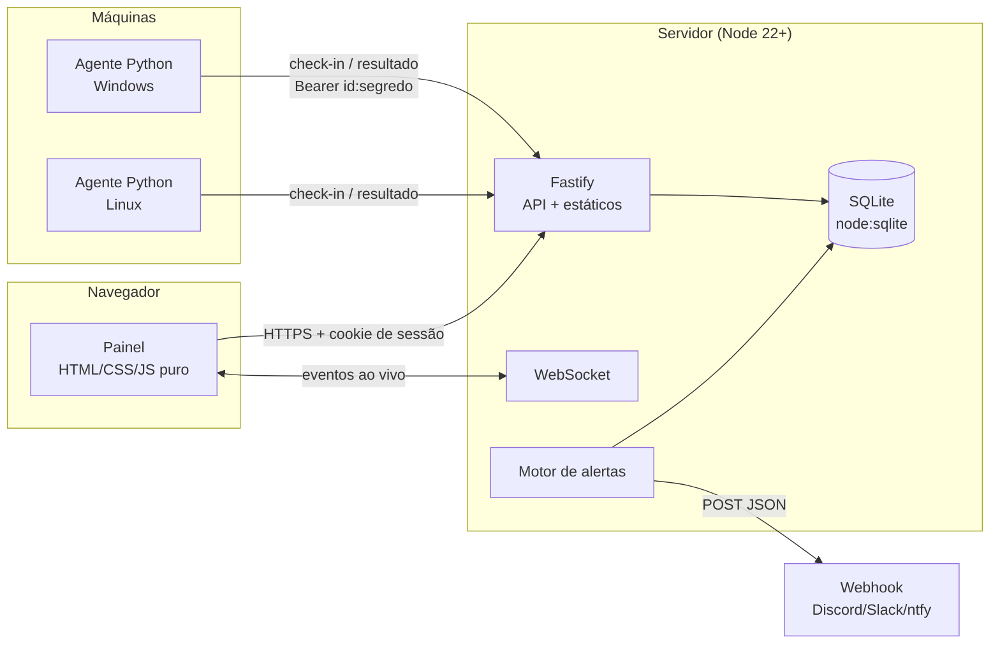

# Farol RMM

Monitoramento e gestão remota (RMM) de computadores Windows e Linux, **auto-hospedado e enxuto**: um servidor Node.js com SQLite embutido, um painel web sem frameworks e um agente Python de um arquivo só.

Inspirado em ferramentas RMM como Tactical RMM e NinjaOne; código 100% original.

## O que ele faz

- **Inventário e métricas em tempo real.** Cada agente faz check-in a cada 15 s com CPU, RAM, discos, uptime, usuário logado e IP. A cada hora envia o inventário completo: sistema, fabricante/modelo, processador, interfaces de rede com MAC e a lista de softwares instalados (registro do Windows; `dpkg`/`rpm` no Linux).
- **Painel web.** Visão geral com totais e máquinas mais carregadas, lista de agentes com busca e filtros, detalhe com gráficos de CPU e RAM (1 h, 24 h, 7 dias), discos, inventário em abas, histórico de execuções e console de comando rápido. Tema escuro (padrão) e claro, responsivo até 375 px, atualização ao vivo por WebSocket.
- **Scripts remotos.** Biblioteca de scripts PowerShell, CMD, Bash e Python, com exemplos prontos (limpar temporários, serviços parados, espaço em disco, reiniciar spooler, informações de rede, processos que mais usam CPU). Execute em um ou vários agentes de uma vez; o agente roda com tempo limite, encerra a árvore de processos se estourar e devolve stdout, stderr e código de saída (até 64 KB cada).
- **Alertas.** Regras globais para CPU e RAM acima de X% por N check-ins, disco acima de X% e agente offline há mais de N minutos. Os alertas abrem e se resolvem sozinhos, aparecem com contador na barra lateral e podem disparar um webhook (Discord, Slack, ntfy).
- **Auditoria.** Logins (e falhas), tokens criados, agentes registrados/revogados, scripts executados, comandos digitados e mudanças de regras, com usuário, data, alvo e IP. Página com filtros.
- **Segurança de verdade.** Senhas com scrypt, 2FA TOTP obrigatório para executar qualquer coisa, reconfirmação por código a cada 10 min, bloqueio progressivo de login, CSRF, CSP restrita, tokens de uso único. Detalhes em [Segurança](#segurança).

## Como é o painel

- **Login**: cartão centralizado; na primeira execução vira o formulário de criação do administrador.
- **Visão geral**: quatro cartões (agentes, online, offline, alertas abertos) com uma faixa de cor à esquerda, a lista das máquinas com maior uso (mini barras de CPU/RAM/disco com o valor em texto) e as últimas execuções com selo de status.
- **Agentes**: tabela com caixa de busca, filtros de status e sistema, ponto verde pulsante para quem está online (sempre acompanhado do texto "Online"/"Offline"), mini barras e ações rápidas que aparecem ao passar o mouse. Marcar várias linhas abre uma barra de ações em lote para executar um script em todas.
- **Detalhe do agente**: cabeçalho com sistema, IP, usuário, uptime e último contato; abas Desempenho (gráficos de linha em SVG feitos à mão, com linha-guia vertical e tooltip ao passar o mouse ou usar as setas do teclado, e tabela de dados alternativa), Inventário (Hardware, Rede, Softwares com busca), Execuções (saída expansível em bloco monoespaçado) e Console.
- **Scripts**: lista à esquerda e editor à direita com numeração de linhas. "Executar…" abre a seleção de agentes e depois a confirmação do código 2FA.

## Arquitetura



```
farol-rmm/
├── servidor/        Node.js + Fastify, ESM puro, sem build
│   ├── src/         app, rotas, banco, alertas, segurança (scrypt, TOTP)
│   ├── scripts/     criar-admin.js
│   └── test/        node --test
├── painel/          SPA com rotas por hash, servida pelo servidor (sem CDN)
│   ├── css/app.css
│   └── js/          app, api, ui, gráficos SVG e uma página por módulo
└── agente/          farol_agente.py (stdlib + psutil), unit systemd e testes
```

O agente sempre **puxa** o trabalho: os jobs pendentes vão na resposta do check-in. Nada no servidor abre conexão para as máquinas, então não é preciso liberar portas nelas.

## Início rápido

**Windows, jeito mais simples:** dê dois cliques em [`iniciar-farol.cmd`](iniciar-farol.cmd). Ele instala as dependências na primeira vez, sobe o servidor, inicia o agente (se este PC já estiver registrado) e abre o painel em http://127.0.0.1:8420. Se o PowerShell disser que "a execução de scripts foi desabilitada", use `npm.cmd` no lugar de `npm` nos comandos abaixo.

### Servidor

Requer Node.js 22.13 ou mais novo.

```bash
cd servidor
npm install
npm run criar-admin            # pergunta usuário e senha
npm start                      # http://127.0.0.1:8420
```

Para automação: `npm run criar-admin -- --usuario admin --senha 'Uma-Senha-Forte-1'`. Se preferir, pule o `criar-admin` e crie o administrador na tela de primeiro acesso do painel (ela só aparece enquanto não existe nenhum usuário).

Depois de entrar, vá em **Configurações** e ative o 2FA: o painel mostra a chave secreta e a URI `otpauth://` para colar no seu aplicativo autenticador. Sem 2FA não é possível executar scripts.

Configuração por variáveis de ambiente ou `servidor/.env` (veja [`servidor/.env.exemplo`](servidor/.env.exemplo)): `PORT`, `HOST` (padrão `127.0.0.1`), `DB` (padrão `dados/farol.db`), `URL_PUBLICA`, `WEBHOOK_URL`, `SESSAO_HORAS`.

### Agente

Requer Python 3.10+ e `psutil` (`pip install -r agente/requirements.txt`, ou `sudo apt install python3-psutil`).

1. No painel, **Agentes → Adicionar agente** gera um token de instalação (uso único, vale 24 h) e mostra o comando pronto para Windows e Linux.
2. Na máquina:

```bash
python farol_agente.py instalar --servidor https://farol.exemplo.com.br --token <TOKEN>
python farol_agente.py rodar             # loop principal
python farol_agente.py rodar --uma-vez   # um check-in (executa jobs pendentes) e sai
```

A configuração fica em `%ProgramData%\Farol\config.json` (Windows), `/etc/farol/config.json` (Linux como root) ou `~/.config/farol/config.json`, com permissão restrita (ACL só para SYSTEM/Administradores/usuário atual; `0600` no Linux). `--config <caminho>` usa outro arquivo.

O servidor também entrega o agente em `/download/farol_agente.py`, que é o que os comandos gerados pelo painel usam.

## Produção

### HTTPS é obrigatório

Deixe o servidor escutando só em `127.0.0.1` e coloque um proxy reverso com TLS na frente. Com [Caddy](https://caddyserver.com/) o certificado é emitido automaticamente:

```caddyfile
farol.exemplo.com.br {
	encode gzip
	reverse_proxy 127.0.0.1:8420
}
```

E no `servidor/.env`:

```ini
URL_PUBLICA=https://farol.exemplo.com.br
```

Com `URL_PUBLICA` em `https://`, o cookie de sessão ganha `Secure`, o servidor envia HSTS e passa a confiar no `X-Forwarded-For` do proxy (para o IP correto na auditoria e no rate limit). Com nginx, use `proxy_pass` com `proxy_http_version 1.1` e os headers `Upgrade`/`Connection` para o WebSocket em `/api/ws`.

O agente **recusa** `http://` para qualquer host que não seja `localhost`/`127.0.0.1`/`::1`, a menos que você passe `--inseguro` explicitamente na instalação. A verificação de certificado TLS fica sempre ligada.

### Agente como serviço

**Windows (Agendador de Tarefas, como SYSTEM, na inicialização)** — em um PowerShell como administrador, depois do `instalar`:

```powershell
New-Item -ItemType Directory -Force "C:\Program Files\Farol" | Out-Null
Copy-Item .\farol_agente.py "C:\Program Files\Farol\"
python -m pip install psutil
$py = (Get-Command python).Source
schtasks /Create /TN "Farol Agente" /SC ONSTART /RU SYSTEM /RL HIGHEST /F `
  /TR "`"$py`" `"C:\Program Files\Farol\farol_agente.py`" rodar"
schtasks /Run /TN "Farol Agente"
```

O `psutil` precisa estar instalado para o Python usado pela tarefa (instale como administrador, não com `--user`). Se preferir um serviço de verdade, o [NSSM](https://nssm.cc/) funciona bem: `nssm install FarolAgente "C:\Python312\python.exe" "C:\Program Files\Farol\farol_agente.py rodar"`.

**Linux (systemd)** — use o arquivo [`agente/farol-agente.service`](agente/farol-agente.service):

```bash
sudo install -Dm755 farol_agente.py /opt/farol/farol_agente.py
sudo cp farol-agente.service /etc/systemd/system/
sudo systemctl daemon-reload && sudo systemctl enable --now farol-agente
journalctl -u farol-agente -f
```

Em falhas de rede o agente tenta de novo com espera exponencial (até 5 min, com variação aleatória). Se for revogado, para de executar e fica tentando a cada 5 min sem fazer nada.

### Backup

Tudo está em um arquivo SQLite (`servidor/dados/farol.db`, modo WAL). Para backup consistente com o servidor rodando: `sqlite3 farol.db ".backup farol-backup.db"`.

## Segurança

| Tema | Como é feito |
|---|---|
| Senhas | `scrypt` (N=2¹⁵, r=8, p=1, 64 bytes) com salt aleatório de 16 bytes; comparação com `timingSafeEqual`. Usuário inexistente também gasta o tempo de um scrypt, para não vazar quem existe. Senha mínima de 10 caracteres com 3 classes. |
| 2FA | TOTP (RFC 6238, SHA-1, 6 dígitos, 30 s) implementado com `node:crypto`, testado com os vetores oficiais do RFC. Tolerância de ±1 passo e **bloqueio de reuso** do mesmo código. Obrigatório para executar scripts/comandos. |
| Modo elevado | Executar exige reconfirmar um código TOTP; a confirmação vale 10 minutos por sessão. |
| Sessão | Token aleatório de 32 bytes no cookie `HttpOnly; SameSite=Strict` (+ `Secure` com HTTPS); no banco fica só o SHA-256. Expira em 12 h; logout apaga; trocar a senha derruba as outras sessões. |
| Força bruta | Rate limit global (300 req/min por IP) e de 10/min em `/api/login`, `/api/setup`, `/api/elevar` e `/api/agente/registrar`. Após 5 falhas a conta bloqueia por 1, 2, 4… até 60 min. |
| CSRF | Cookie `SameSite=Strict` **e** header customizado `X-Farol: 1` obrigatório em toda mutação do painel (formulários de outros sites não conseguem enviá-lo sem CORS, que não é habilitado). O WebSocket confere a origem. |
| Cabeçalhos | `@fastify/helmet` com CSP `default-src 'self'`, sem `unsafe-inline` (nenhum script ou estilo inline), `frame-ancestors 'none'`, `object-src 'none'`, `base-uri 'none'`, `Referrer-Policy: no-referrer`, HSTS com HTTPS. |
| Entrada | Todas as rotas têm JSON Schema no Fastify (tipos, tamanhos, enums, padrões de UUID). SQL sempre parametrizado. |
| Saída | O painel nunca usa `innerHTML` com dados: tudo é montado com `createElement`/`textContent`. Nomes de máquinas, softwares e saídas de scripts são exibidos como texto. |
| Agentes | Token de instalação de 32 bytes, uso único, expira em 24 h, guardado como SHA-256. No registro cada agente recebe ID + segredo próprios (32 bytes, só o hash fica no servidor) e se autentica com `Authorization: Bearer <id>:<segredo>`. Revogar corta o acesso na hora e cancela os jobs pendentes. Um agente só consegue ler e responder os próprios jobs. |
| Transporte do agente | Só fala com o servidor configurado (redirecionamentos são recusados), exige HTTPS fora do localhost, verificação de certificado sempre ativa. |
| Auditoria | Toda ação sensível vai para a tabela `auditoria` com usuário, horário, alvo, detalhes e IP. Comandos digitados no console são registrados (até 500 caracteres). |

Riscos que continuam sendo seus: quem tem o login + 2FA do painel executa código como SYSTEM/root em todas as máquinas — proteja a conta, o servidor e o arquivo do banco. O webhook é configurado pelo administrador e o servidor fará POST para a URL que estiver lá.

## API do agente

Todas as rotas recebem e devolvem JSON. As duas últimas exigem `Authorization: Bearer <id>:<segredo>`.

| Método | Rota | Corpo | Resposta |
|---|---|---|---|
| `POST` | `/api/agente/registrar` | `{ token, info: { hostname, so, so_versao, arquitetura, versao_agente } }` | `{ id, segredo, intervalo }` |
| `POST` | `/api/agente/checkin` | `{ metricas: { cpu, ram_usada, ram_total, discos[], uptime, usuario, ip }, info?, inventario? }` | `{ intervalo, pedirInventario, jobs: [{ id, shell, conteudo, timeout }] }` |
| `POST` | `/api/agente/resultado` | `{ job_id, codigo_saida, stdout, stderr, duracao_ms, erro?, timeout? }` | `{ ok: true }` |
| `GET` | `/download/farol_agente.py` | — | o script do agente |

Status de um job: `pendente` → `enviado` → `sucesso` / `falha` / `timeout`. Um job enviado que não volta em `timeout + 2 min` vira `expirado`.

## Testes

```bash
cd servidor && npm test                                   # 33 testes, node --test
python -m unittest discover -s agente/testes -v           # 17 testes
```

O servidor é testado com `fastify.inject` e banco em memória: hash de senha, vetores TOTP do RFC 6238 (SHA-1/256/512), login com 2FA, bloqueio progressivo, CSRF, CSP, rate limit, token de instalação (uso único, expirado, inválido), check-in autenticado e negado, ciclo completo de job, truncamento, regras de alerta abrindo e resolvendo, webhook e auditoria. O agente é testado na coleta de métricas e inventário, execução com timeout matando a árvore de processos, truncamento, montagem do payload e recusa de `http://` não local. O GitHub Actions roda os dois conjuntos a cada push.

## Roadmap

- Acesso remoto (terminal interativo e área de trabalho via WebRTC)
- Patches: listar e aplicar atualizações do Windows Update / `apt`
- Checks agendados (scripts recorrentes com alerta por código de saída) e tarefas agendadas
- Multi-tenant: clientes e sites, com agentes agrupados
- RBAC: papéis (somente leitura, técnico, administrador) e vários usuários
- Assinatura dos scripts e atualização automática do agente

## Limitações

- Um único administrador por enquanto (o banco já suporta vários usuários, falta a interface e os papéis).
- Sem acesso remoto interativo: o console é "envia comando, recebe saída".
- O agente é um script Python, não um binário: a máquina precisa de Python 3.10+ e `psutil`. Comandos PowerShell no Linux só funcionam se o `pwsh` estiver instalado.
- Jobs ficam na fila até o próximo check-in (até ~15 s de latência).
- Regras de alerta são globais; não há exceções por máquina nem janelas de manutenção.
- Histórico de métricas guarda 1 ponto por minuto por 7 dias; SQLite atende bem algumas centenas de agentes, não milhares.
- QR code do 2FA não é gerado; use a chave ou a URI `otpauth://`.

## Licença

MIT © Eduardo Lorenzo
